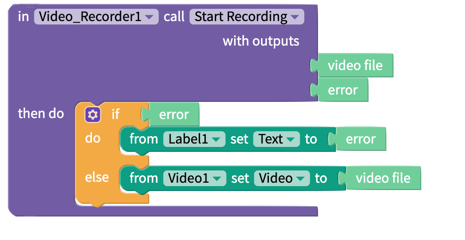

# Video Recorder

## Record a Video

You can record a timed video, where the app records for a set amount of time, or an untimed video, where the user can choose how long to film for.

You can display the videos you record with the [Video](video.md) component. You can also save you recorded videos to the cloud with our [Media DB](media-db.md) component. Once you have saved a video to the cloud, you can store the URL as a [cloud variable](variables.md#cloud-variables) or in an [Airtable DB](spreadsheet.md) to make it accessible through the app on other devices.

### Timed Video Recording

| Input | Data Type | Function |
| :--- | :--- | :--- |
| seconds | Integer | Specify a number of seconds to record for |

<table>
  <thead>
    <tr>
      <th style="text-align:left">Output</th>
      <th style="text-align:left">Data Type</th>
      <th style="text-align:left">Function</th>
    </tr>
  </thead>
  <tbody>
    <tr>
      <td style="text-align:left">video file</td>
      <td style="text-align:left">
        
web: Ogg

        
Android: MP4

        
iOS: MOV

      </td>
      <td style="text-align:left">Returns the recorded video</td>
    </tr>
    <tr>
      <td style="text-align:left">error</td>
      <td style="text-align:left">text</td>
      <td style="text-align:left">If there is an error, returns an error message</td>
    </tr>
  </tbody>
</table>

### Untimed Video Recording

<table>
  <thead>
    <tr>
      <th style="text-align:left">Output</th>
      <th style="text-align:left">Data Type</th>
      <th style="text-align:left">Function</th>
    </tr>
  </thead>
  <tbody>
    <tr>
      <td style="text-align:left">video file</td>
      <td style="text-align:left">
        
web: Ogg

        
Android: MP4

        
iOS: MOV

      </td>
      <td style="text-align:left">Returns the recorded video</td>
    </tr>
    <tr>
      <td style="text-align:left">error</td>
      <td style="text-align:left">text</td>
      <td style="text-align:left">If there is an error, returns an error message</td>
    </tr>
  </tbody>
</table>

## Select a Camera

You can record with the front or back camera of your device.

### Set Camera

Select a camera to film with.

### Show Current Camera

Returns the camera currently being used to record. Will return `front` or `back`.

