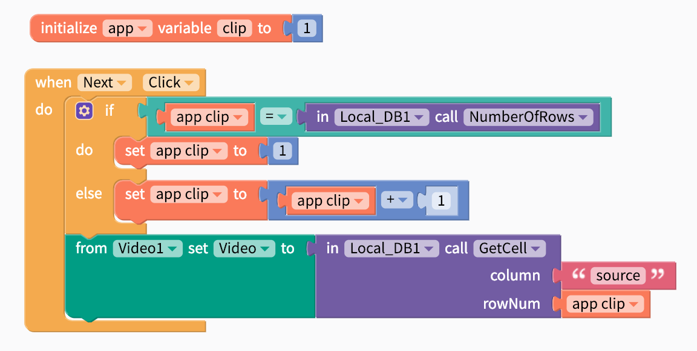

# Video

The Video component lets you play videos in your app that are stored in the cloud or in your app \(be careful, video files can be quite large and exceed the 50 MB [size limit](projects/assets.md#app-size-limits-50-mb-per-app) for apps\). App users can easily pause, rewind or fast-forward the video with the built in player.

* [Set Video](video.md#set-video)
* [Edit Video size](video.md#edit-video-size)
* [Change Video](video.md#change-video)

## Set Video

There are a few ways you can set a video source in your app:

1. **Provide a link to the video.** \(The link has to end in `.mp4`, `.mov`, …so videos uploaded to YouTube and other video sharing sites may not work.\)
2. **Upload a video to your app.** Be careful of the Thunkable 50 MB [app size limit](projects/assets.md#app-size-limits-50-mb-per-app).

## Edit Video size

You can set how tall the Video is using the `height` property and set how wide it is using the `width` property.

**`Height`**

* **Fill container \(default\)-** The Video fills the entire screen vertically
* **Fit contents -** The Video’s height changes to fit the contents it contains
* **Relative size -** The Video fills the specified percentage of the screen
* **Absolute size -** Sizes the Video to a specified number of pixels

**`Width`**

* **Fill container \(default\) -** The Video fills the entire screen horizontally
* **Fit contents -** The Video’s width changes to fit the contents it contains
* **Relative size -** The Video fills the specified percentage of the screen
* **Absolute -** Sizes the Video to a specified number of pixels

## Change Video

If you want to build a video player \([try this sample app](https://x.thunkable.com/copy/f915eb9a227c4214f5f6c4521d31a86c)\), you may want to change the video source when an event happens \(like clicking the next button\). If you store your videos in something like a Local DB, you could change the videos with the blocks below:

