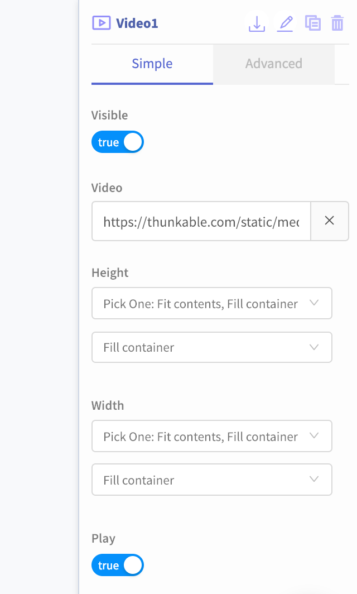
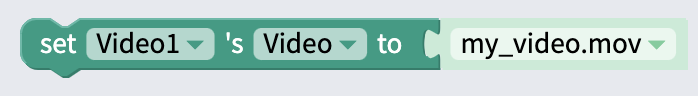
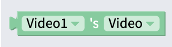

# Video

## Video Overview


Please note that video files can be quite large and might exceed the 50 MB [size limit](assets.md#app-size-limits-50-mb-per-app) for your project. 


The Video component lets you play videos in your app that are stored in the cloud or in your app. App users can easily pause, rewind or fast-forward the video with the built in player.

## Set Video

There are a few ways you can set a video source in your app:

1. **Upload a video to your app.** Be careful of the Thunkable 50 MB [app size limit](assets.md#app-size-limits-50-mb-per-app)
2. **Provide a link to the video.** The link has to end in `.mp4`, `.mov`, …so videos uploaded to YouTube and other video sharing sites may not work.

Please note that the Video component is not recommended for streaming live video content. 

## Edit size and position

You can drag and drop your component into position, and set its size.   
You can set exact values for the component's Height and Width, and X and Y coordinates, in its properties.

**Height:** Height of Button in pixels  
**Width:** Width of Button in pixels

**X:** position of top left corner of Button on X-axis  
**Y:** position of top right corner of component on Y-axis

## Set to Auto-Play

To set a video to play automatically, just toggle the Play property to `true` 

## Blocks

### Set Video

### Get Video

See what video is currently set as the Video component's source

