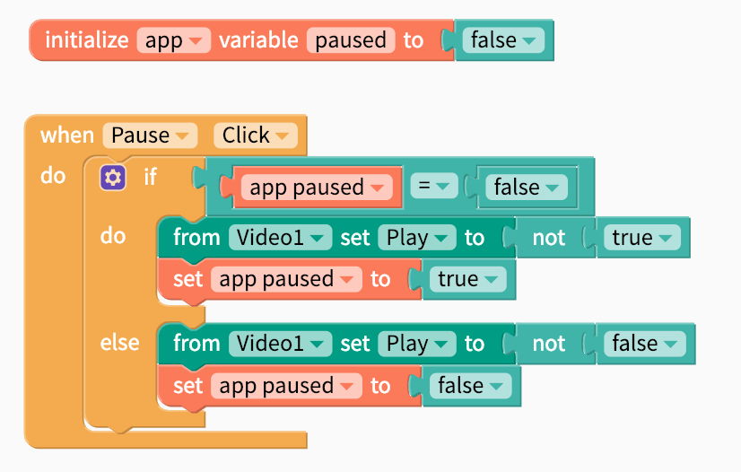

# Video

## Video Overview

* [Set Video](video.md#set-video)
* [Edit Video size](video.md#edit-video-size)
* [Set to Auto-Play](video.md#set-to-auto-play)
* [Change Video](video.md#change-video)
* [Pause or Un-Pause](video.md#pause-or-un-pause)


Please note that video files can be quite large and might exceed the 50 MB [size limit](projects/assets.md#app-size-limits-50-mb-per-app) for your project. 


The Video component lets you play videos in your app that are stored in the cloud or in your app. App users can easily pause, rewind or fast-forward the video with the built in player.

## Set Video

There are a few ways you can set a video source in your app:

1. **Upload a video to your app.** Be careful of the Thunkable 50 MB [app size limit](projects/assets.md#app-size-limits-50-mb-per-app)
2. **Provide a link to the video.** The link has to end in `.mp4`, `.mov`, …so videos uploaded to YouTube and other video sharing sites may not work.

Please note that the Video component is not recommended for streaming live video content. 

## Edit Video size

You can set how tall the Video is using the `height` property and set how wide it is using the `width` property.

**`Height`**

* **Fill container \(default\)-** The Video fills the entire screen vertically
* **Fit contents -** The Video’s height changes to fit the contents it contains
* **Relative size -** The Video fills the specified percentage of the screen
* **Absolute size -** Sizes the Video to a specified number of pixels

**`Width`**

* **Fill container \(default\) -** The Video fills the entire screen horizontally
* **Fit contents -** The Video’s width changes to fit the contents it contains
* **Relative size -** The Video fills the specified percentage of the screen
* **Absolute -** Sizes the Video to a specified number of pixels

## Set to Auto-Play

To set a video to play automatically, just toggle the Play property to `true` 

## Change Video

If you want to build a video player [like this sample app](https://x.thunkable.com/copy/f915eb9a227c4214f5f6c4521d31a86c), you may want to change the video source when an event happens, eg. when the Next button is clicked. If you index your videos in something like a Local DB, you can change the video being displayed with the blocks below:

## Pause and Resume Video 

The easiest way to permit the user to pause or resume a video is through the built-in video player. 

There is the option to also pause a video in the blocks editor. To do so, you can use blocks like the ones shown below:


For Android creators, we recommend using the built in video player to pause and resume videos. Using the blocks below will reset the video to the beginning of the video \(and not where it was last played\)


