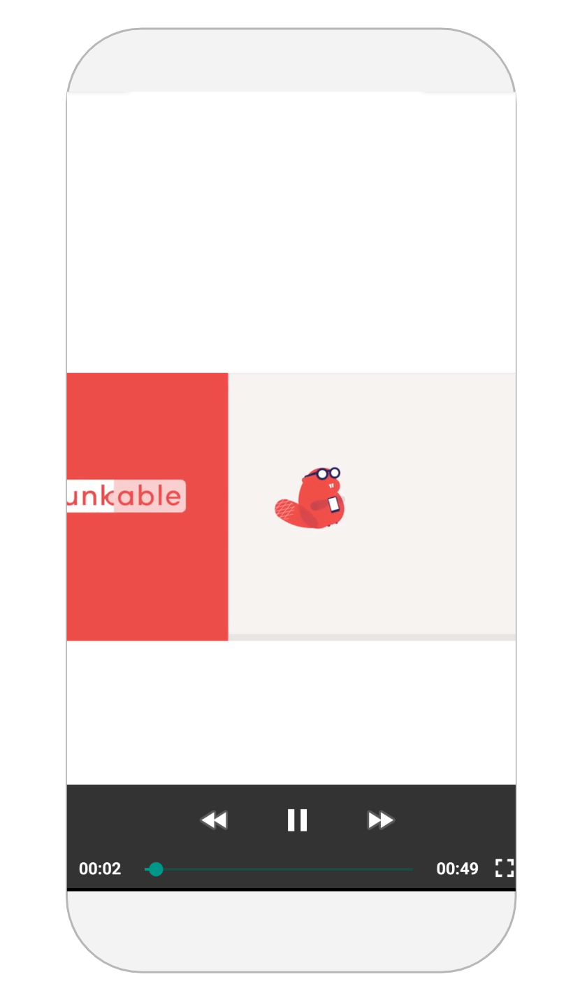

# Video

## Video Overview

The Video component lets you play videos in your project that are stored in the cloud or in your project. Users can easily pause, rewind or fast-forward the video with this player.

## Set Video

There are a few ways you can set a video source in your app:

### Upload Video File to your app

You can upload a video file as an [asset](assets.md#uploading-and-managing-assets) in your project. Be careful of the Thunkable 50 MB [app size limit](assets.md#app-size-limits-50-mb-per-app) if you choose to upload a file to your project.

### Enter URL to choose video to display

Enter the URL of the video you want to show in your project.

The link has to end in `.mp4`, `.mov`, …so videos uploaded to YouTube and other video sharing sites may not work.

Please note that the Video component is not recommended for streaming live video content.&#x20;

## Properties

### Video

| Name  | Description                                                   | Data Type                               |
| ----- | ------------------------------------------------------------- | --------------------------------------- |
| Video | The video users can play within your app.                     | Uploaded video file or the video's URL. |
| Play  | Toggle whether or not video file auto-plays when Screen opens | True/False                              |

### Layout

| Property    | Description                                                                               | Data Type                                    |
| ----------- | ----------------------------------------------------------------------------------------- | -------------------------------------------- |
| X           | Location of top left corner of Video component on X-axis, where the left hand side is X=0 | Number                                       |
| Y           | Location of top left corner of Video component on Y-axis, where the top side is Y=0       | Number                                       |
| Height      | Height of Video component in pixels                                                       | Number                                       |
| Width       | Width of Video component in pixels                                                        | Number                                       |
| Resize Mode | Define dimensions of the video component/container                                        | Select from list `[Stretch, Float in Place]` |

## Blocks

### Properties

Set and get [Properties](video.md#properties) of the Video component

#### Video

#### Play

#### Computed Height

Returns the height of the Video on the device screen in pixels.

#### Computed Width

Returns the width of the Video on the device screen in pixels.

#### Visible

