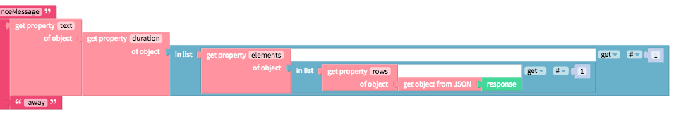

# Web API

Great data is an essential part of many apps built today and the Web API component enables apps to retrieve data from any public or private API \(application programming interface\) service on the web. For more advanced developers who have write access to a private API, this component also enables you to upload and delete data.

To see what public APIs are available, we recommend [this list from Todd Motto](https://github.com/toddmotto/public-apis)

## Set up

For most public APIs, you'll likely have to first create an account to get your own unique API key. This is usually to prevent individuals from making too many requests or to charge developers when they exceed certain free limits.

Once you have the API key, you'll need to enter the unique URL into the property field of the Web API component

| Property | Description |
| :--- | :--- |
| URL | The url for the web request which usually contains an API key |

## Get and format \(parse\) data


To retrieve data from an API, you simply need to use the `Get` block.

| Event | Description |
| :--- | :--- |
| Get \(`response`, `status`,`error`\) | Performs an HTTP GET request using the Url property and retrieves the `response`. Reports `status` of request and if request does not go through, will report an `error` |

Most APIs will return data in a less than usable format for your app so we'll take a few moments to walk through a few examples of how to format data \(also known as parsing\) using our [Object](objects.md) blocks

### Example 1: [Open Weather Map API](https://openweathermap.org/current)

You can find a working example of this in the sample app, [Weather](web-api.md).

One of the most common output formats for APIs is JSON, short for Javascript Object Notation. The Open Weather Map API returns a JSON file like the one below.

```text
{
    "coord":{"lon":85.17,"lat":26.67},
    "weather":[{"id":804,"main":"Clouds","description":"overcast clouds","icon":"04n"}],
    "base":"stations",
    "main":{
        "temp":298.312,
        "pressure":1005.31,
        "humidity":94,
        "temp_min":298.312,
        "temp_max":298.312,
        "sea_level":1011.47,
        "grnd_level":1005.31},
    "wind":{"speed":2.96,"deg":79.5005},
    "clouds":{"all":92},
    "dt":1533157826,
    "sys":{
        "message":0.0034,
        "country":"IN",
        "sunrise":1533080664,
        "sunset":1533128790},
    "id":1273043,
    "name":"Dhaka",
    "cod":200
}
```

#### **Convert JSON to Object**


If you simply want to retrieve the temperature \(`"temp":` in line 6\), you will have to first convert the JSON response into objects, an _entity_ like a person that has _properties_ to describe them like smart. Objects can be embedded within another object.

In your JSON response, objects can be found within the `"` quotes `"` followed by a colon `:`. The properties of the object is follows the colon `:` but is within the `{` curly brackets`}`.

In the example above, `"coord":` , `"weather":`, `"base":` and `"main":` are both objects and properties of the overall object since they are contained within the `{` curly brackets `}`.

#### **Get Property of Object**


Once you have converted the JSON into objects, you can then specify the `objects` and `property` that you are interested in. To get the temperature \(`"temp":` in line 6\), we'll want to find the `temp` property of the `main` object which is the property of the overall object


### Example 2: [Google Maps Distance Matrix API](https://developers.google.com/maps/documentation/distance-matrix/start)

You can find a working example of this in the sample app, [Ride](web-api.md).

The JSON output of the Google Maps Distance Matrix API seems similar to the Open Weather Map API with one notable exception: it includes objects, properties and _lists_. Lists are items bounded by `[` square brackets `]`.

```text
{
   "destination_addresses" : [ "Los Angeles, CA, USA" ],
   "origin_addresses" : [ "San Francisco, CA, USA" ],
   "rows" : [
      {
         "elements" : [
            {
               "distance" : {
                  "text" : "617 km",
                  "value" : 616620
               },
               "duration" : {
                  "text" : "5 hours 45 mins",
                  "value" : 20680
               },
               "status" : "OK"
            }
         ]
      }
   ],
   "status" : "OK"
}
```

If you want to retrieve the `"text"` property in line 13, you'll have to:

* convert the JSON to an object 
* select the `"rows"` property of the object
* select the first item in the list
* select the `"elements"` property of the rows object
* select the first item in the list
* select the `"duration"` property of the elements object
* select the `"text"` property of the duration object

You can see the example below for how this would look using the [Object](objects.md) and [List](lists.md) blocks



## Upload data

Uploading and deleting data is usually reserved for a private API that you or your organization owns

| Event | Description |
| :--- | :--- |
| Put \(`response`, `status`,`error`\) | Performs an HTTP PUT request using the Url property and retrieves the `response`. Reports `status` of request and if request does not go through, will report an `error` |
| Post \(`response`, `status`,`error`\) | Performs an HTTP POSTT request using the Url property and retrieves the `response`. Reports `status` of request and if request does not go through, will report an `error` |

## Delete data

| Event | Description |
| :--- | :--- |
| Delete \(`response`, `status`,`error`\) | Performs an HTTP DELETE request using the Url property and retrieves the `response`. Reports `status` of request and if request does not go through, will report an `error` |

