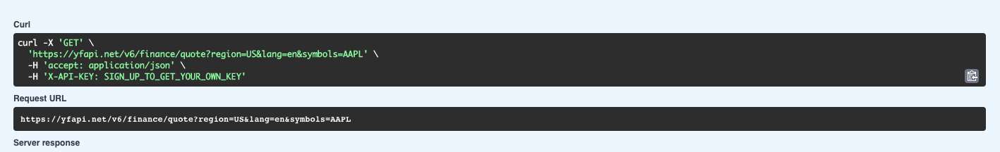
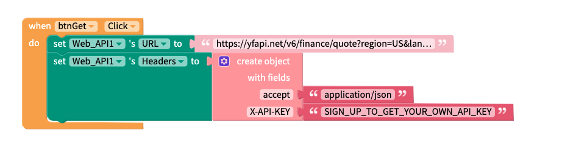
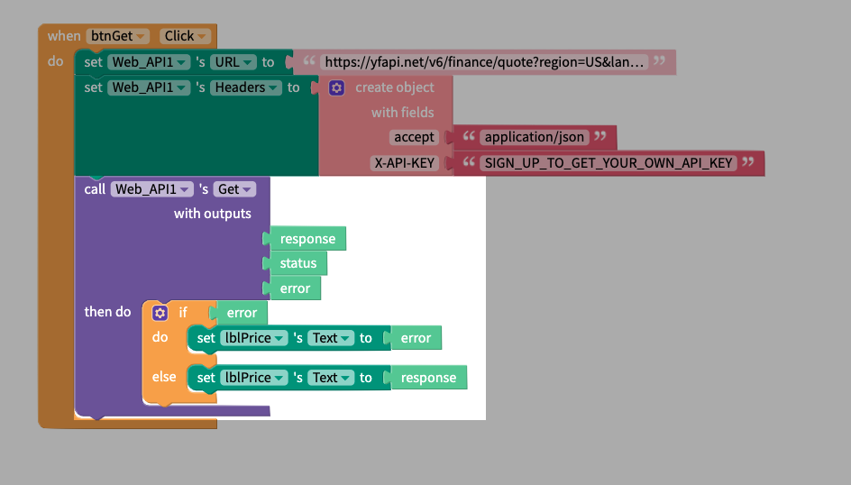

# Arrays and Object

## What are JSON Arrays and Objects?

In our first tutorial we tried to build an app powered by Google Sheets that would tell us the latest price for a give stock symbol. It worked, to an extent, but was lacking the reliability and scalability that an API can provide. In this tutorial we will revisit that first topic but now we will set up an account and use a special API key to access the data we want.&#x20;

### Yahoo! Finance

There are many free and paid APIs that provide stock market data but one long-established and well known example is Yahoo! Finance. As with all the APIs in this section, the first thing you will need to do is register for an account with the API owner. Having an account with the API developer will allow you to create your own developer key. Similar to a physical key, your developer API key will grant you access to that information that is "locked away" on the API server. Unlike a physical key however, your developer key is unique so the API owner can see who is accessing the server, when they're accessing it and how many requests they're making. Since usage can often be tied to billing it is recommended that you treat your keys as secrets and don't share them with anyone else.&#x20;

Once you've done this you can then perform all the usual CRUD operations which that API supports.&#x20;

### GET Stock Data

<figure><figcaption></figcaption></figure>

Now that your developer account is set up you can start making requests. The first thing we can do is to get the price for a given stock. We do this by sending a GET request to the _/v6/finance/quote_ endpoint. Notice in the Curl section above that two headers are also required here; _accept_ and _X-API-KEY._ If you're unfamiliar with setting API headers take a look at the [<mark style="color:purple;">Setting API Headers</mark> ](../no-auth-apis/setting-headers.md)section.

### Block it out

In your Thunkable project your blocks should look like this:

<figure><figcaption></figcaption></figure>

Next, we want to request the data and do some simple error handling. To do this we will add the following blocks:

<figure><figcaption></figcaption></figure>

