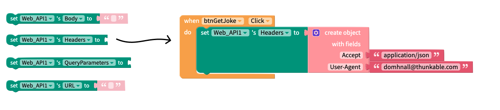
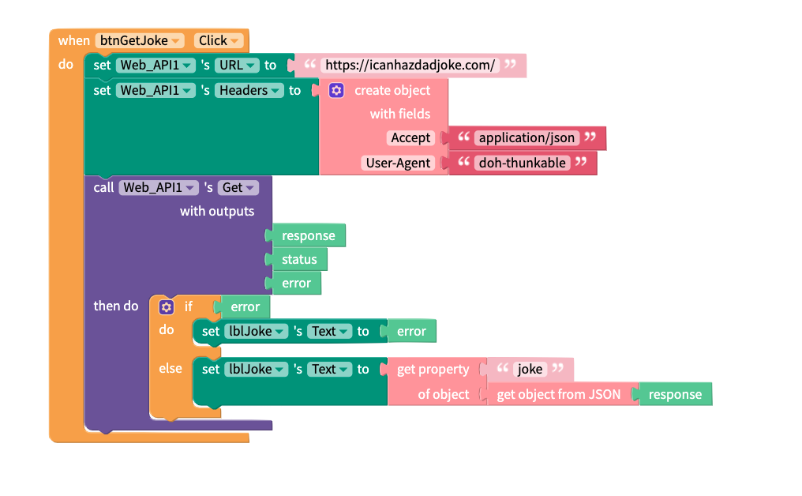
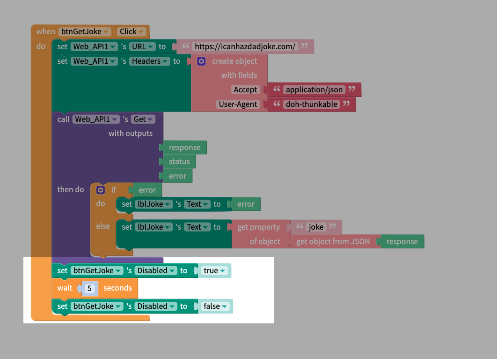
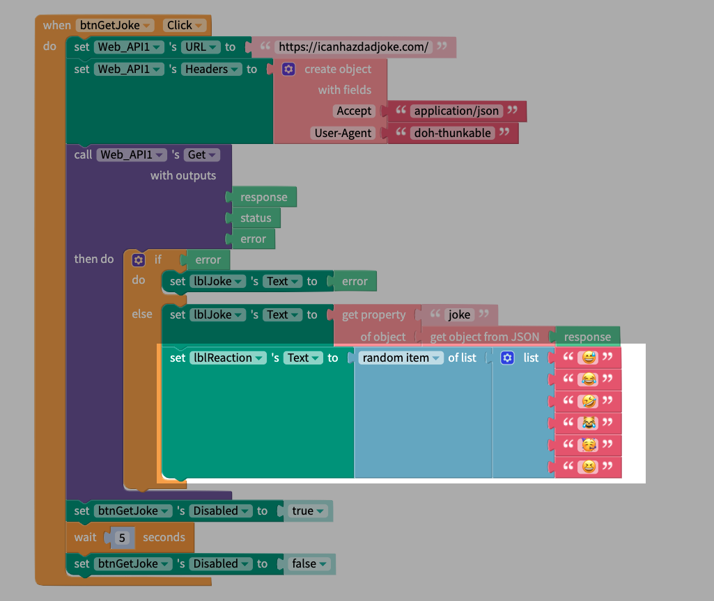

# Setting Headers

## When do I use an API?

Every time you send a request to an endpoint it takes time and bandwidth. From your perspective, as an app developer you want to minimise wait times in your app. From the perspective of your API developer you want to keep your bandwidth usage as low as possible - especially if it's something they're paying for and you're using for free. Thankfully these issues are two sides of the same coin and&#x20;

By the end of this lesson you'll understand how to:

1. Maximise app speeds while minimising API calls.&#x20;
2. Set  WebAPI headers.&#x20;

### Overview


**Remix link:** [<mark style="color:blue;">**https://x.thunkable.com/projectPage/620e5675396bbd001066d68a**</mark>](https://x.thunkable.com/projectPage/620e5675396bbd001066d68a)<mark style="color:blue;">****</mark>


According to [their docs](https://icanhazdadjoke.com/api), _icanhazdadjoke.com can be used as an API for fetching a random joke, a specific joke, or searching for jokes in a variety of formats._

<figure><figcaption></figcaption></figure>

### Setting API Headers

The API allows us to get jokes in HTML, JSON or plain text format. In order for us to specify _which_ format we would like the response in we need to use a **header.** In the WebAPI drawer, there are four different properties we can set; Body, Headers, QueryParameters and URL. Going back to the API docs, we are asked to specify an `Accept` header and a `User-Agent` header. To request a response in JSON format from the API we set the value of the Accept header to `application/json`. The user agent header is used as a way for us to identify ourselves to the API developer. Recall that this is a free service and we don't want to take advantage of the generosity of the developer. In this case I've used an email address since it gives the developer a way to contact me directly if there are too many calls being made.&#x20;

<figure><figcaption></figcaption></figure>

### GET Jokes

The API request is quite similar to the one we saw in the previous tutorial. After specifying the URL and the Headers we send a `Get` request to the API. The `if error then do` block is for basic error handling and should not be omitted. To display the text of the joke itself we get the `joke` property from the response object.&#x20;

<figure><figcaption></figcaption></figure>







Request a response in HTML, JSON or plain text format. Defaults to text/plain if not specified.



A good user agent should include the name of the library or website that is accessing the API along with a URL/e-email where someone can be contacted regarding the library/website.



```javascript
{
  "id": "R7UfaahVfFd",
  "joke": "My dog used to chase people on a bike a lot. It got so bad I had to take his bike away.",
  "status": 200
}
```



### Read the Joke

Once the joke is displayed on screen we can temporarily "deactivate" the Get Joke button. This serves two purposes. First of all, it gives the user a moment to read (and appreciate) the joke and secondly it prevents users from making multiple requests to the API per second by repeatedly clicking on the button. In the example below we add a pause of 5 seconds, which means that at most a user can request 12 jokes per minute. This still a good number of jokes, and a lot better than not having any pause at all.&#x20;

<figure><figcaption></figcaption></figure>

### Ba Dum Tss

Finally, for a bit of visual interest, we add in a random emoji reaction. This is obviously a pretty simple thing to do, but you can easily expand on this by adding some sound effects or a laugh track to your app.

<figure><figcaption></figcaption></figure>


## Conclusion

In this section we've looks at why it's a good idea to use a proper API, how to set the URL and make a GET request, how to implement basic error handling, how to convert a JSON response to an Object and pull information out of that object and finally we learned how to set API headers and implement some basic rate limiting.&#x20;

In the next section we'll increase the complexity slightly and learn how to use APIs that require some basic auth or an access token before we can perform any other operations.&#x20;

### Questions?

If you have any questions about this tutorial, please post them in this topic over in the Thunkable Community


**Community Link:** [<mark style="color:blue;">**https://community.thunkable.com/t/jokes-api-tutorial**</mark>](https://bit.ly/3tQsuBz)<mark style="color:blue;">****</mark>

