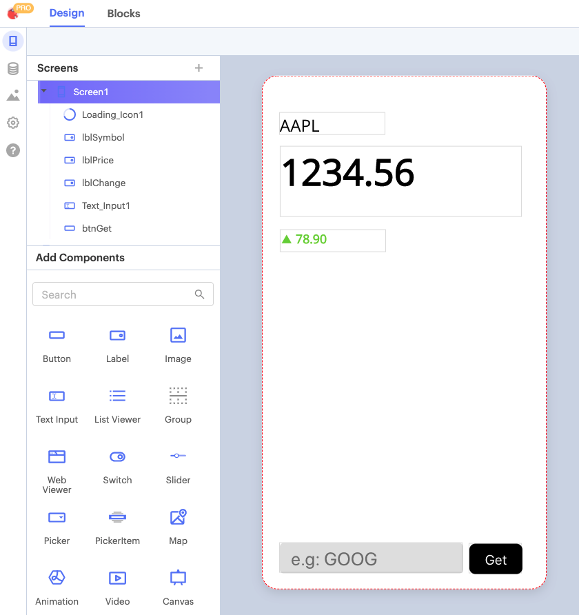

# Update Data in a Data Source

To answer this question, we're going to build an app that _doesn't_ use APIs. Instead, we will use a spreadsheet as an intermediary to get stock market data. Our app will write ticker symbols to the spreadsheet and get stock prices back from the sheet. Most of the time. Hopefully.&#x20;

By the end of this demo you should understand that:

1. API requests are asynchronous, which means:
2. For the best performance, you should always aim to minimize the total number of calls in your app.&#x20;

 (1) (2).png>)

### Google Sheet

Let's get started by making a copy of this sheet, which has all the functions your app will need. By default the Google Finance function will return the most recent price for a given symbol. Alternatively, you can pass any one of a number of different parameters to find the corresponding value. In the image below, we are showing the price in cell **B2** and showing the chance in price in cell **B3.** With everything set up in our Google Sheet we can connect this directly to our Thunkable project.

 (1).png>)

### Thunkable Project

The user interface for this example is quite simple, but if you want yours to look identical to the tutorial then go ahead and make a copy of it for yourself.&#x20;

<figure><figcaption></figcaption></figure>

Next step is to connect to our Sheet. Click on the Data tab on left hand side of your screen and choose "Google Sheets" as your data source.

<figure><figcaption></figcaption></figure>

Finally, choose the Google Finance sheet and create a new data source within your Thunkable project.&#x20;

<figure><figcaption></figcaption></figure>

### Send Data

Since we're just testing the waters we won't worry too much about data validation just yet. The first thing we'll do is get a ticker symbol from the user and send it to our sheet. In your Thunkable blocks it looks like this:

<figure><figcaption></figcaption></figure>

### Get Data

After a few seconds the data will update and we can call the new values from the Sheet.&#x20;

<figure><figcaption></figcaption></figure>

Now, the first and last thing we do is show/hide the loading icon. In between, we send a new value to the sheet, wait 3 seconds and then (hopefully!) get the most recent price back. Since we have no control over how long it takes our Sheet to update this 3 second values is really a best guess. Most of the time it will be a lot faster, but other times it will be significantly slower and we'll end up fetching the previous value from the spreadsheet. In general we want to avoid doing things like this in our app and instead make asynchronous calls to an API.&#x20;

### Asynchronous Requests

As we've just seen in the previous example, having fixed wait times in our app is a bad idea. In the best case scenario the operation is completed much quicker than our delay and we've kept our user waiting unnecessarily. The worst case scenario is that the delay isn't long enough and we get inaccurate or out of data information for our use. A much more sensible approach is to use an **asynchronous** approach. In this context asynchronous simply means that the request and response don't happen at fixed, or predefined, intervals. In the case of a synchronous approach we might send a value to our sheet and then repeatedly check, every 1 second, to see if the result has been updated. With an asynchronous request we send our data to the API and when the response is ready it gets sent back to the app. Our app "listens" for this response from the API and only acts when the response has been received.&#x20;

### Data Formatting

The other value in our spreadsheet is the **change** in price. This will either have gone up, gone down or stayed the same. While this isn't - strictly speaking - related to working with APIs, it's nice to demo how you can make decisions in your app, based on different responses you might get. In this case, we want the text to be green if the price has increased, red if it has decreased and black if it's stayed the same.&#x20;

<figure><figcaption></figcaption></figure>

### Conclusion

In this tutorial we learned that we can use Thunkable data sources to read and write data to a spreadsheet in the cloud. This is a fantastic tool to have at our disposal but is poorly suited to something like a simple stock market app. In the next two section we will learn how to request data from an API, parse the response and set the request headers. Armed with this new information we will then be able to create a much more robust and scalable app for stock market data.&#x20;
