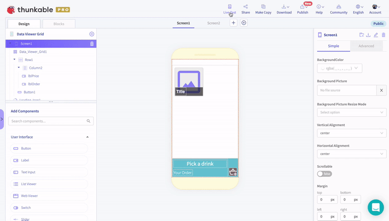
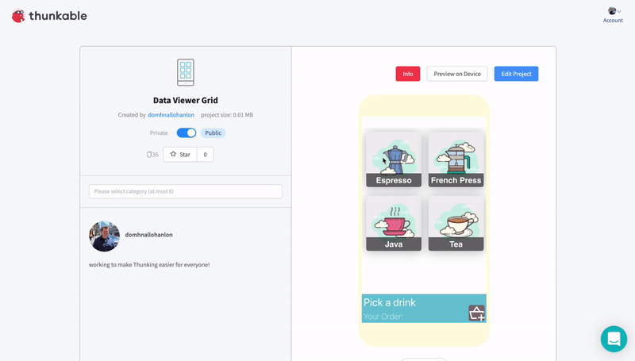

# 🌐 Preview on the Web

Preview on the Web allows you to live preview your own project directly from your browser. Simply click on "Live Test" to preview your own app in a pop-up window.  

 You can also preview any _public_ app, directly from the Project Detail Page. Here's [one example](https://x.thunkable.com/projectPage/5ea6ed029ce3d64d1d3a27dc) but you can find thousands of others in the public gallery.

### Unsupported Components

Not all components are supported on the web at this time so please see the list below of components that are **`not supported`**:

| Component | Category | Status |
| :--- | :--- | :--- |
| **Map** | Location | **`Not supported yet`** |
| **Share** | Social | **`Not supported yet`** |
| **Push Notification** | Social | **`Not supported yet`** |
| **AdMob** | Monetization | **`Can not be supported`** |
| **Bluetooth Low Energy** | Sensors | **`Not supported yet`** |
| **Accelerometer** | Sensors | **`Supported but may not work as expected`** |
| **Gyroscope** | Sensors | **`Supported but may not work as expected`** |
| **Magnetometer** | Sensors | **`Supported but may not work as expected`** |
| **Alert** | User Interface | **`Not supported yet`** |
| **Date Input** | User Interface | **`Not supported yet`** |
| **Time Input** | User Interface | **`Not supported yet`** |
| **Speech Recognizer** | Voice | **`Not supported yet`** |
| **Assistant** | Voice | **`Not supported yet`** |
| **Photo Library** | Image | **`Not supported yet`** |
| **Barcode Scanner** | Image | **`Not supported yet`** |
| **Local Storage** | Data | **`Not supported yet`** |
| **Smart Contract** | Data | **`Will not be supported`** |
| **Blockchain Wallet** | Data | **`Will not be supported`** |

