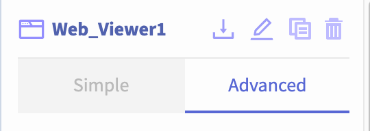
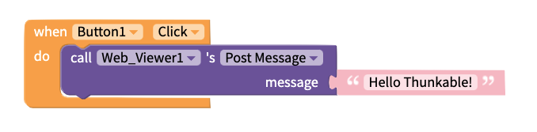
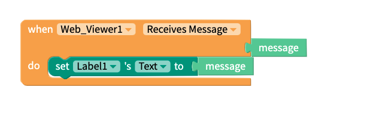
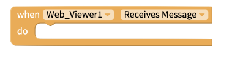
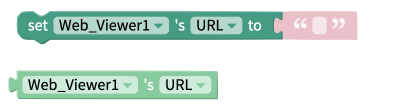

# Web Viewer

## Video Tutorial



## Web Viewer Overview


Some websites may not appear when previewing your app on the web. You may need to [Live Test](get-started/live-test.md#live-test) the app on a device, or [download](download.md) and install the app, to see your web page.


* [Properties](web-viewer.md#properties)
* [Set URL](web-viewer.md#set-url)
* [Go Back or Forward](web-viewer.md#go-back-forward)
* [Edit Web Viewer Size](web-viewer.md#edit-web-viewer-size)
* [Add Spacing](web-viewer.md#add-spacing)
* [Post Message/Receive Message](web-viewer.md#post-message-receive-message)
* [Events](web-viewer.md#events)
* [Functions](web-viewer.md#functions)
* [Properties](web-viewer.md#properties-1)

## Properties

In the Design panel, you can set many properties of the Web Viewer.

### Simple

**URL:** Set initial URL to be displayed in the Web Viewer  
**Height:** Set Height of Web Viewer  
**Width:** Set Width of Web Viewer  
**Visible:** Toggle whether or not the Web Viewer is visible in the app  
**Margin \(top, bottom, left, right\):** Set a defined distance between the Web Viewer and its neighboring components on the Screen  
**Padding \(top, bottom, left, right\):** Set a defined distance between the border of the Web Viewer and its contents  
**Border:** Set the **width, radius, color** and **style** of a border around the perimeter of the Web Viewer 

## Set URL

To open up a website in your app, you need to provide  the Web Viewer with a URL. 

A URL is kind of like a street address - it tells the web viewer the location of the website on the internet.

* **URL:** Enter in the link to the website or an image. The URL must include https:// 

Note: Can also accept .html files that have been uploaded to the app \(great for offline use\). 

## Go Back/Forward

You can use blocks to navigate back through previously visited web pages. Once you have gone back, you can also use blocks to navigate forward through your visited pages again.


The Back block may not work when you test your app on the web, but will work when [Live Testing](get-started/live-test.md#live-test) your app and in [downloaded](download.md) apps


## Edit Web Viewer size

You can set how tall the Web Viewer is using the height property and set how wide it is using the width property.

**Height**

* **Fill container -** The Web Viewer fills the entire screen vertically
* **Fit contents -** The Web Viewer’s height changes to fit the contents it contains
* **Relative size -** The Web Viewer fills the specified percentage of the screen
* **Absolute size -** Sizes the Web Viewer to a specified number of pixels

**Width**

* **Fill container -** The Web Viewer fills the entire screen horizontally
* **Fit contents -** The Web Viewer’s width changes to fit the contents it contains
* **Relative size -** The Web Viewer fills the specified percentage of the screen
* **Absolute -** Sizes the Web Viewer to a specified number of pixels

## Add Spacing

You change the spacing and positioning of the Web Viewer with the Margin and Padding properties. 

**Margin**

* You can specify how much space you want between the border and the contents of Web Viewer using either pixel or percent values.

**Padding**

* You can specify how much space you want between the edges of the Web Viewer and the screen using either pixel or percent values.

## Manage Permissions

You can toggle whether the Web Viewer automatically requests the user's location. Some websites require access to the user's location to work. However, if you do not plan on displaying a website that needs this permission in your app, then you may not want your app to request an unnecessary permission.

To set whether or not the Web Viewer requests the user's location, go to the Design tab and click on your Web Viewer. In the panel on the right hand side of the screen, click on the **Advanced** tab.

Scroll down until you see a switch labeled **Geolocation Enabled**. Use this switch to toggle whether your Web Viewer requests the user's location.

## Post Message/Receive Message

If you own the website being displayed in your Web Viewer, you can send and receive messages between your website and the Web Viewer using Javascript.

You can see examples of sending/receiving messages and get further setup instructions [here](https://github.com/thunkable/webviewer-extension/).

### See Also

You may also find the [Web API](web-api.md) component useful for sending/receiving information between your app and a website.

## Events

### Receives Message

## Functions

### Back 

Go back to the previous page visited.

### Forward 

Move forward to the next page in your browser history.

### Post Message 

Post a message.

### Reload 

Reload the web viewer.

### Value from Post

Returns any message that was received after calling the Post Message function.

## Properties

### Height 

The set and get height blocks work with the Height property of the web viewer component. Acceptable input values are. 

* Number of Pixels
* Percentage Height
* "Fit Contents"
* "Fill Container"

The `Computed Height`block returns the on-screen dimensions of the web viewer, after it has been rendered on-screen. The value returned is an integer, representing the size of the web viewer in pixels.

### 

### Width 

The set and get width blocks work with the Width property of the web viewer component. Acceptable input values are. 

* Number of Pixels
* Percentage Width
* "Fit Contents"
* "Fill Container"

The `Computed Width`block returns the on-screen dimensions of the web viewer, after it has been rendered on-screen. The value returned is an integer, representing the size of the web viewer in pixels.

### Visible

###  

The set and get visible blocks are used to show or hide the entire button component. Acceptable values are:

* True
* False

### URL

The set URL block is used to change the web address that is displayed in the web viewer. Please note that this block need to be used in conjunction with the [reload](web-viewer.md#reload) function and the web viewer only supports connections via https. If you try to use http your website will not be displayed.

The get URL block returns the "default" url in your project, i.e the value that you set in the designer. At this time it does not dynamically return the URL of the pages that is currently being displayed. 

