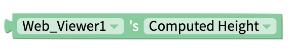

# Web Viewer

## Web Viewer Overview


Some websites may not appear when previewing your app on the web. You may need to [Live Test](live-test.md#live-test) the app on a device, or [download](download.md) and install the app, to see your web page.


## Properties

In the Design panel, you can set many properties of the Web Viewer.

| Property | Description | Data Type |
| :--- | :--- | :--- |
| URL | Set initial URL to be displayed in the Web Viewer. Should begin with HTTPS:// | URL |

### Layout

| Property | Description | Data Type |
| :--- | :--- | :--- |
| X | Location of top left corner of Web viewer on X-axis, where the left hand side is X=0 | Number |
| Y | Location of top left corner of Web Viewer on Y-axis, where the top side is Y=0 | Number |
| Height | Height of Web Viewer in pixels | Number |
| Width | Width of Web Viewer in pixels | Number |
| Visible | Set whether the Web Viewer is visible | True/False |

### **Style**

| **Property** | Description | Data Type |
| :--- | :--- | :--- |
| Border Width | Width of border around Web Viewer in pixels | Number |
| Border Radius | Radius of corners of border on Web Viewer in degrees | Number |
| Border Color | Color of border \(only visible if border width &gt; 0\) | Color |
| Border Style | Set whether border style is solid, dotted or dashed  \(only visible if border width &gt; 0\) | Select from menu |

## Blocks

### Post Message/Receive Message

If you own the website being displayed in your Web Viewer, you can send and receive messages between your website and the Web Viewer using Javascript.

You can see examples of sending/receiving messages and get further setup instructions [here](https://github.com/thunkable/webviewer-extension/).

#### See Also

You may also find the [Web API](web-api.md) component useful for sending/receiving information between your app and a website.

### Events

#### Receives Message

### Functions

#### Back 

Go back to the previous page visited.

#### Forward 

Move forward to the next page in your browser history.

#### Post Message 

Post a message.

#### Reload 

Reload the web viewer.

#### Value from Post

Returns any message that was received after calling the Post Message function.

### Properties

#### Computed Height 

Returns the on-screen dimensions of the web viewer, after it has been rendered on-screen. The value returned is an integer, representing the size of the web viewer in pixels.

#### Computed Width 

Returns the on-screen dimensions of the web viewer, after it has been rendered on-screen. The value returned is an integer, representing the size of the web viewer in pixels.

#### Visible

The set and get visible blocks are used to show or hide the entire component. 

#### URL

The set URL block is used to change the web address that is displayed in the web viewer. Using HTTPS URLs is recommended.

