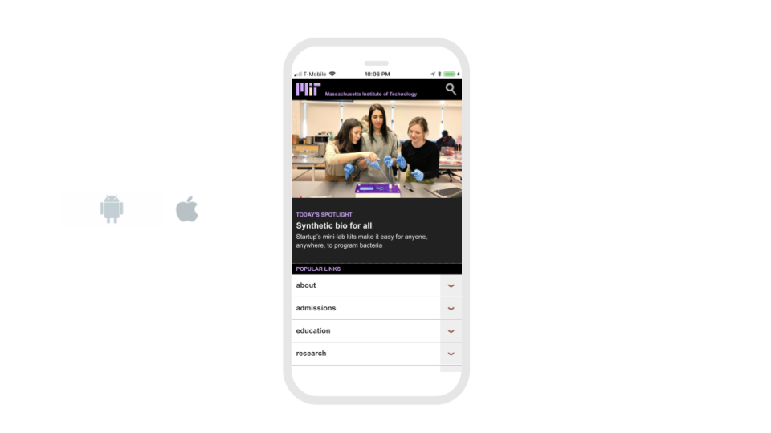

# Web Viewer

## Video Tutorial




Some websites may not appear when [Live Testing](get-started/live-test.md) your app. If you don't see your website when Live Testing your app, try [downloading and installing](download.md) your app to see if your website displays.


## Overview

* [Set URL](web-viewer.md#set-url)
* [Edit Web Viewer size](web-viewer.md#edit-web-viewer-size)
* [Add spacing](web-viewer.md#add-spacing)
* [Post Message/Receive Message](web-viewer.md#post-message-receive-message)

## Set URL

To open up a website in your app, you need to provide  the Web Viewer with a URL. 

A URL is kind of like a street address - it tells the web viewer the location of the website on the internet.

* **URL:** Enter in the link to the website or an image. The URL must include https:// 

Note: Can also accept .html files that have been uploaded to the app \(great for offline use\). 

## Go Back/Forward

You can use blocks to navigate back through previously visited web pages. Once you have gone back, you can also use blocks to navigate forward through your visited pages again.


The Back block may not work when you test your app on the web, but will work when [Live Testing](get-started/live-test.md#live-test) your app and in [downloaded](download.md) apps


## Edit Web Viewer size

You can set how tall the Web Viewer is using the height property and set how wide it is using the width property.

**Height**

* **Fill container -** The Web Viewer fills the entire screen vertically
* **Fit contents -** The Web Viewer’s height changes to fit the contents it contains
* **Relative size -** The Web Viewer fills the specified percentage of the screen
* **Absolute size -** Sizes the Web Viewer to a specified number of pixels

**Width**

* **Fill container -** The Web Viewer fills the entire screen horizontally
* **Fit contents -** The Web Viewer’s width changes to fit the contents it contains
* **Relative size -** The Web Viewer fills the specified percentage of the screen
* **Absolute -** Sizes the Web Viewer to a specified number of pixels

## Add Spacing

You change the spacing and positioning of the Web Viewer with the Margin and Padding properties. 

**Margin**

* You can specify how much space you want between the border and the contents of Web Viewer using either pixel or percent values.

**Padding**

* You can specify how much space you want between the edges of the Web Viewer and the screen using either pixel or percent values.

## Manage Permissions

You can toggle whether the Web Viewer automatically requests the user's location. Some websites require access to the user's location to work. However, if you do not plan on displaying a website that needs this permission in your app, then you may not want your app to request an unnecessary permission.

To set whether or not the Web Viewer requests the user's location, go to the Design tab and click on your Web Viewer. In the panel on the right hand side of the screen, click on the **Advanced** tab.

Scroll down until you see a switch labeled **Geolocation Enabled**. Use this switch to toggle whether your Web Viewer requests the user's location.

## Post Message/Receive Message

If you own the website being displayed in your Web Viewer, you can send and receive messages between your website and the Web Viewer using Javascript.

You can see examples of sending/receiving messages and get further setup instructions [here](https://github.com/thunkable/webviewer-extension/).

### See Also

You may also find the [Web API](web-api.md) component useful for sending/receiving information between your app and a website.

