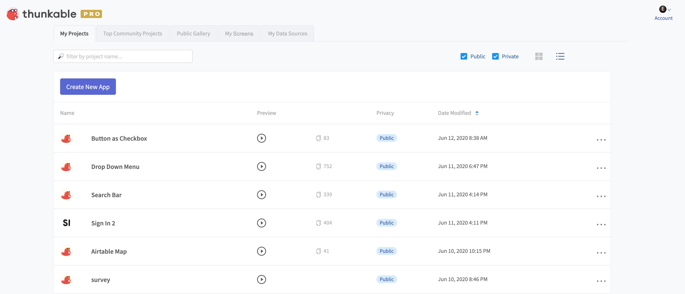
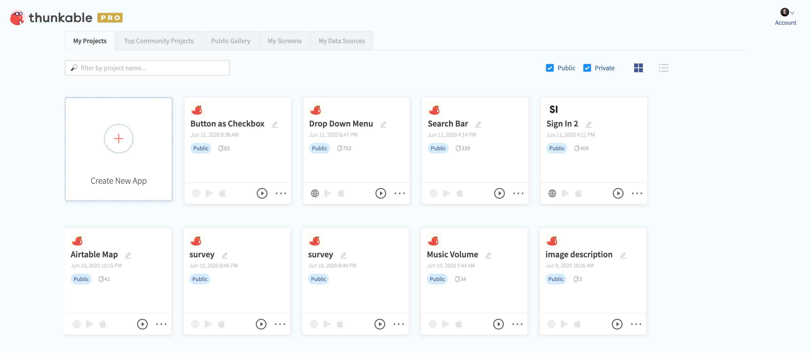
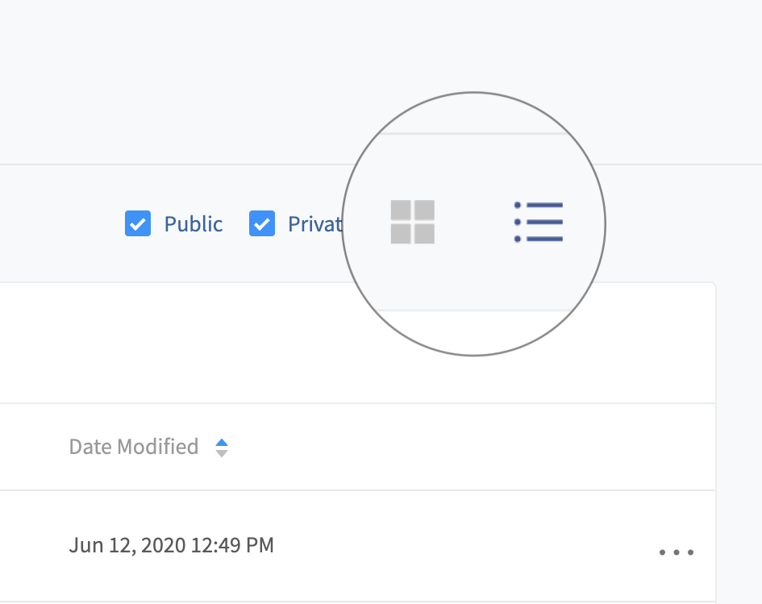
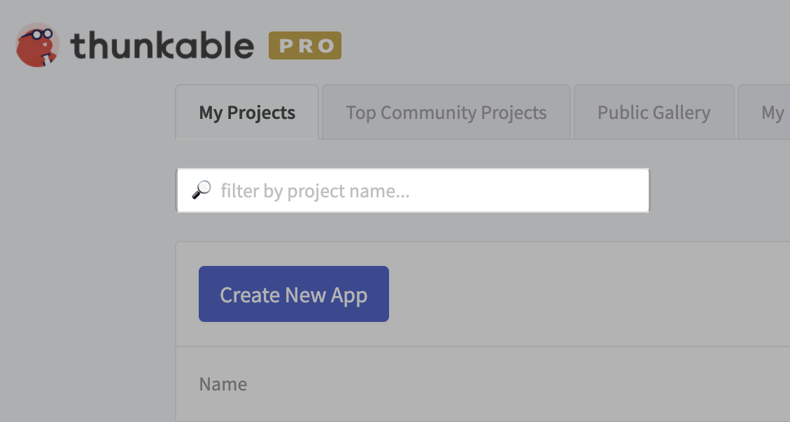
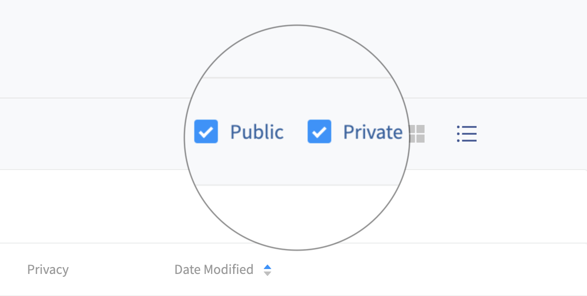
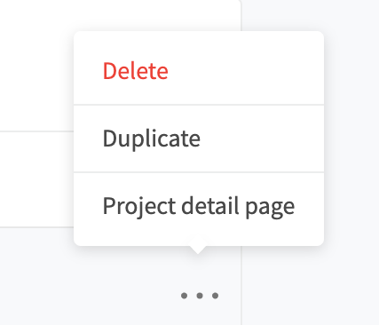

# Your Thunkable Projects Page

## Your Projects Page

You can find your projects page at [x.thunkable.com/projects](https://x.thunkable.com/projects). \
This is the first page you see when you sign in.

## Viewing your projects

Thunkable lets you choose between viewing your projects in **List View **or **Grid View**.

You can decide whether to view your projects in List View or Grid View in the upper right corner of the page.

## Filtering your projects

### Search Bar

You can use the search bar to filter your projects by name

### Filter public/private projects

[PRO Thunkable creators](https://thunkable.com/#/pricing) are able to create [private projects](projects.md#private-projects). You can use the Public and Private checkboxes to filter your projects, showing only public projects or only private projects.

## Your Project Menu - Delete, Duplicate, and more

When you click on the 3 dots on a project card (Grid View) or list item (List View), you can see some project options.

You can **delete **your project, **duplicate **your project, or see your **Project detail page.**

### **Your Project Detail Page**

On the Project Detail page, you can test out your app, similar to when it has been published as a [mobile web app](publish-as-a-web-app-pro.md#mobile-web-app).&#x20;

Your project will be shown in your chosen [Default App Layout](project-settings.md#default-app-layout).

You can also view information about the project, such as its name, creator, project size, and how many times it has been remixed or favorited.

If the project is a remix of another project, the name and creator of the original project will be displayed on the left.

****
